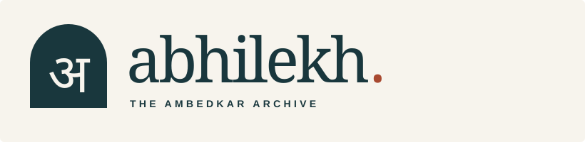
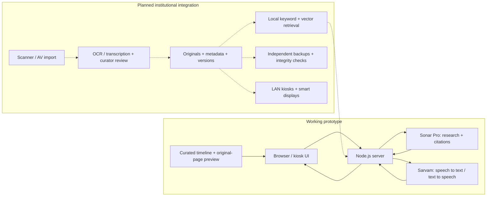

| Team ID | Problem Statement ID | Team name |
| :--- | :--- | :--- |
| **133270** | **SIH26096** | **honeyBadger** |

<p align="center">
  
</p>

# Abhilekh · Smart India Hackathon prototype

**Digital Heritage Archive for Memorials, Manuscripts & Ambedkar: AI-Powered Institutional Archive and Audio-Visual Knowledge Platform**  
**Organisation:** Ministry of Social Justice and Empowerment · **Category:** Hardware · **Theme:** Smart Education

> **Early prototype.** Timeline, cited research and voice conversation work. Siddharth is a recorded preview; institutional tools and device integration are planned.

## The idea

- **One archive:** Connect Ambedkar’s writings, speeches, manuscripts and historical records.
- **Two learning depths:** Visitor stories and spoken questions; researcher access to originals and citations.
- **Physical access:** Shared institutional archive → touch kiosks and smart displays, with optional cloud AI.
- **Curator control:** Review OCR and metadata; preserve originals and track corrections.

## Features at a glance

| Feature | What it offers | Status in this repository |
| :--- | :--- | :--- |
| **3D timeline** | 14 milestones, images, sources and event-to-research navigation | Working |
| **Research Room** | Cited answers, follow-ups, source panel and note export | Working; published web sources |
| **Multilingual voice** | Dictation, read-aloud and spoken conversation | Connected; internet and microphone required |
| **Siddharth AI avatar** | Visual guide using the same answer pipeline | Recorded preview; live animation planned |
| **Research dashboard & login** | Persistent collections, annotations, source comparison and research visualisations | Workflow previews |
| **OCR scanning** | Scan → text extraction → human correction → approved archive record | Workflow preview |
| **Institutional login & curator tools** | Staff roles, metadata review, publication approvals and version history | Workflow previews |
| **Kiosk connection & settings** | Device pairing, language/audio configuration and exhibit synchronisation | Workflow previews |
| **Collections & knowledge maps** | Full-text/summary reading, AV records and evidence-linked relationships | Planned |
| **Preservation & translation** | Checksums, independent backups, reviewed translations and stored narration | Planned |

**Answer/voice languages:** English, Hindi, Marathi, Tamil, Telugu, Bengali, Gujarati and Kannada. Full archive/UI translation remains planned.

## Technical approach

- **Interface:** React + Vite; touch navigation, captions and accessibility controls.
- **Research:** Node.js → Perplexity Sonar Pro → numbered citations; domain restrictions, caching and usage limits.
- **Voice:** Sarvam Saaras v3 → research → Bulbul v3; turn-based speech with pause/end/interrupt.
- **Planned retrieval:** FastAPI, PostgreSQL + pgvector, multilingual E5 and keyword/vector rank fusion (RRF).
- **Planned digitisation:** OpenCV + Tesseract; FFmpeg + speech recognition; human review before indexing.
- **Planned avatar:** Evaluate LAM + Audio2Expression; no live renderer is connected yet.

## Architecture

Solid arrows show the current request flow; dotted arrows show the proposed institutional extension.



- **MVP:** Existing laptop, browser/touch device, microphone and speakers; optional second display.
- **Proposed deployment:** Archive host + LAN + kiosks + displays + scanner + independent backups/UPS; assess existing equipment before reuse.
- **Offline:** Loaded exhibit content remains usable. Live research/voice need internet; offline restart and device sync are planned.

## Try the prototype

1. **Life & timeline** → event → **Know more** → cited research → save/export notes.
2. **AI guide** → **Voice conversation** → **AI Avatar** preview.
3. **Landing page / Workspaces** → planned modules → Research, Institution or Kiosk workflows.

## Run locally

Verified with Node **25.6.1**. Setup details: [Development guide](docs/DEVELOPMENT.md).

```sh
npm ci
cp .env.example .env.local
# Set PERPLEXITY_API_KEY and SARVAM_API_KEY in .env.local.
npm run dev
```

Open **http://127.0.0.1:5173**. PowerShell: `Copy-Item .env.example .env.local`. Preserve an existing configuration; never commit server keys.

```sh
npm test
npm run build
npm start
```

Deploy the **backend and frontend** together. Vercel/Netlify adapters are included; configure server variables and `APP_ORIGIN`. Public deployment is not yet verified.

## Evidence & documentation

- **Checks:** 51 automated tests, build and responsive UI checks: [Verification](VERIFICATION.md). Kiosk acoustics and archival accuracy require separate evaluation.
- **Historical sources:** [Dr. Ambedkar Foundation](https://ambedkarfoundation.nic.in/know-ambedkar.html), [Parliament Digital Library](https://eparlib.sansad.in/bitstream/123456789/782459/1/Golden_Jubilee_Republic_of_India.pdf), universities and institutional collections; see [source records](src/archive.js).
- **Further detail:** [Development & deployment](docs/DEVELOPMENT.md) · [Voice setup](VOICE_SETUP.md) · [Source and image credits](SOURCE_NOTES.md).
- **Content:** Historical records and illustrations are labelled separately; source/asset licences apply. No institutional affiliation is implied.
